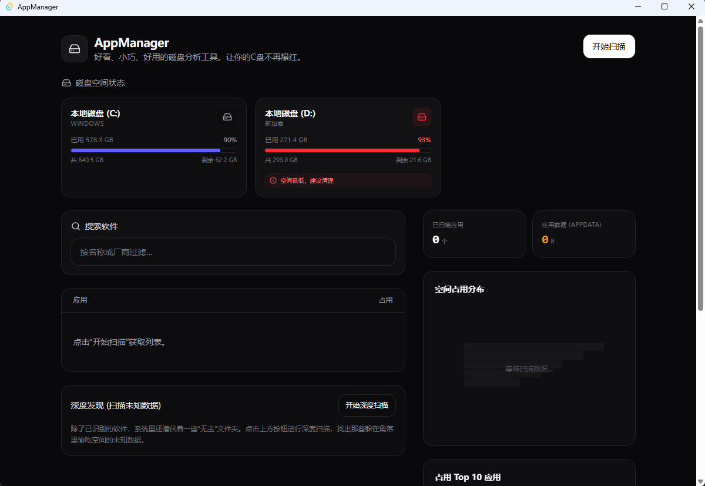

# AppManager

一款小巧、精致、高性能的 Windows 桌面工具，旨在帮助用户深度分析并可视化展示电脑软件的实际空间占用。

**如果你看到这个项目了，点个star吧，求求了~这是我唯一想更新的动力~**


## 灵感来源
大量的软件虽然不是病毒，但也像流氓软件一样，过多的占用用户C盘的空间。用户的C盘满了，很大原因都是各种软件及其数据占用了大量的空间。
我找寻了很多工具，发现都没法做到像手机界面一样好看、小巧。并且能够实时展示软件的空间占用，帮助用户快速定位流氓软件。
windows自带的应用管理器只能展示软件本身的占用空间，对于更占用空间的数据、日志等却无法展示。
所以我造就了这样一款软件，目前实现的第一步是展示软件的安装目录占用空间。后续会增添更多好用的功能。

## Todo

- [√] 实现软件安装目录占用空间的展示
- [ ] 可以进行软件卸载或软件数据清楚
- [ ] 展示可视化图表，帮用户了解情况
- [ ] 快捷进行各种设置，让用户C盘不再占满。

## 预览



## 🚀 核心功能

- **软件清单识别**：自动从系统注册表和 UWP 应用商店获取已安装软件列表。
- **深度空间归因**：不仅仅计算安装目录，还能智能匹配关联 `AppData` 和 `ProgramData` 下的存储目录，精准定位 C 盘空间去向。
- **极速扫描**：基于 Rust 的并发能力，利用 `jwalk` 在数秒内完成数十万个文件的扫描与统计。
- **现代化可视化界面**：类手机存储管理的列表展示，支持按占用大小排序、搜索及明细查看。
- **精致 UI/UX**：使用 React + Tailwind CSS 打造，配合 Framer Motion 实现流畅的动效。

## 🛠️ 技术选型

- **后端 (Rust Core)**:
  - [Tauri v2](https://tauri.app/): 跨平台应用框架。
  - `jwalk`: 高性能并发目录遍历。
  - `sysinfo` / `winreg`: 系统信息采集与注册表操作。
- **前端 (UI)**:
  - [React](https://reactjs.org/) + [TypeScript](https://www.typescriptlang.org/)
  - [Tailwind CSS](https://tailwindcss.com/): 现代化的样式方案。
  - [Lucide React](https://lucide.dev/): 精致图标库。
  - [Framer Motion](https://www.framer.com/motion/): 动画效果。

## 📂 项目结构

```text
AppManager/
├── src/                # 前端 React 源代码
│   ├── features/       # 业务功能模块 (Apps, Audit)
│   ├── lib/            # 工具库封装
│   └── App.tsx         # 入口组件
├── src-tauri/          # 后端 Rust 源代码
│   ├── src/
│   │   ├── apps/       # 核心业务逻辑 (Windows 归因算法)
│   │   └── main.rs     # 程序启动点
│   └── Cargo.toml      # Rust 依赖配置
└── package.json        # 前端依赖配置
```

## 🛠️ 开发与构建

### 环境准备

1. 安装 [Rust](https://www.rust-lang.org/tools/install) 环境。
2. 安装 [Node.js](https://nodejs.org/) 及 [pnpm](https://pnpm.io/)。
3. 安装 [Tauri 依赖](https://tauri.app/v2/guides/getting-started/prerequisites/)。

### 运行开发版本

```powershell
pnpm install
pnpm tauri dev
```

### 构建正式版本

```powershell
pnpm tauri build
```

## 🤝 贡献指南

欢迎提交 Issue 或 Pull Request 来完善这个项目！

1. Fork 本仓库。
2. 创建你的特性分支 (`git checkout -b feature/AmazingFeature`)。
3. 提交你的修改 (`git commit -m 'Add some AmazingFeature'`)。
4. 推送到分支 (`git push origin feature/AmazingFeature`)。
5. 开启一个 Pull Request。

## 📄 开源协议

本项目采用 [MIT License](LICENSE) 开源协议。

---

*由 [AppManager 团队](https://github.com/AppManager) 倾力打造*
